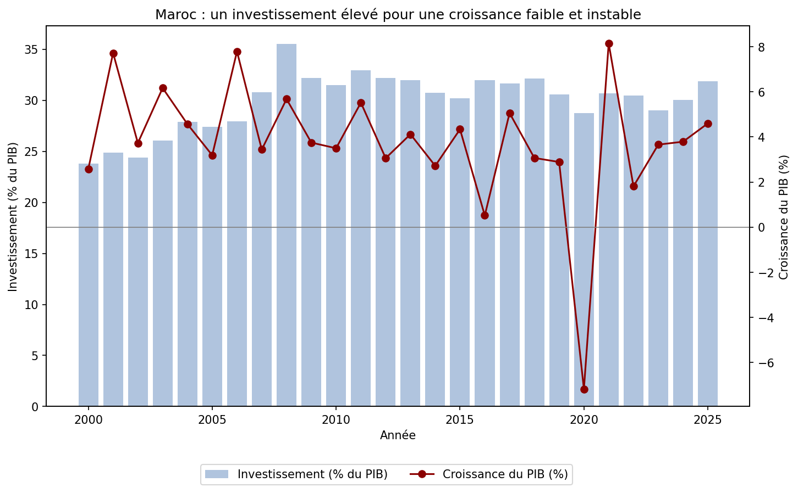
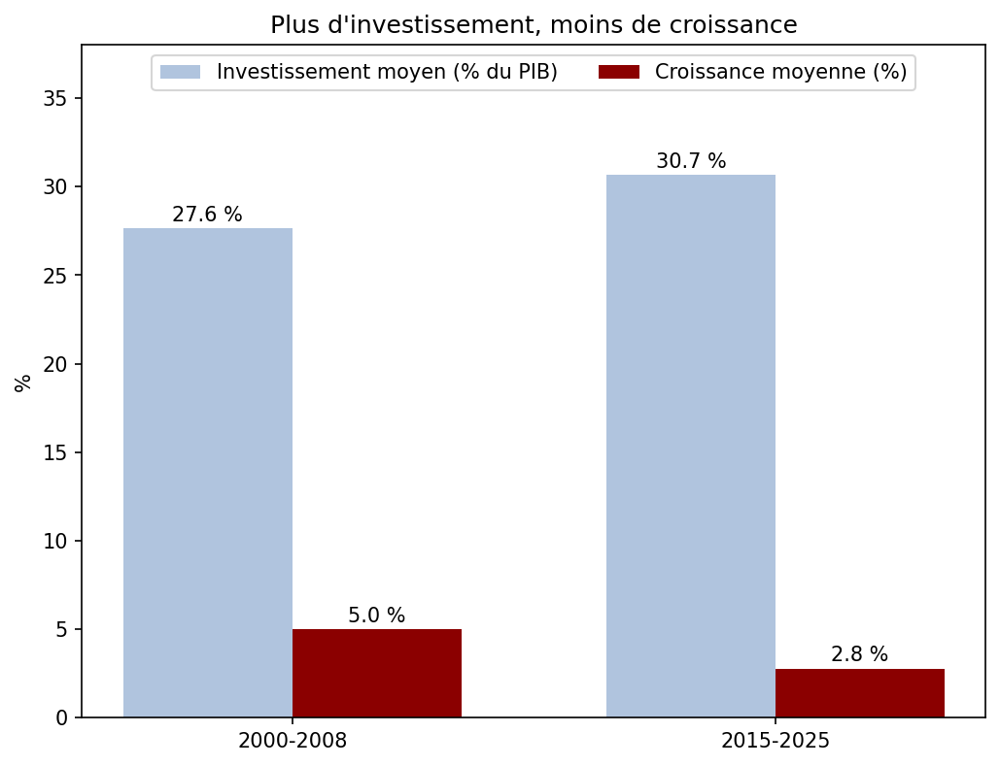

# Qu'est-ce qui freine la croissance au Maroc ?

## 1. Introduction et problématique

Depuis le début des années 2000, le Maroc investit massivement : autoroutes, port Tanger Med, TGV, plans industriels et énergétiques. Pourtant, la croissance économique ralentit. Ce travail cherche à comprendre ce paradoxe à partir de données réelles couvrant la période 2000–2025.

**Problématique :** pourquoi un effort d'investissement parmi les plus élevés au monde ne se traduit-il pas par une croissance plus forte au Maroc ?

## 2. Sources des données

Toutes les données proviennent de la **Banque mondiale – World Development Indicators** (mise à jour du 13/07/2026), période 2000–2025.

| Indicateur | Code | Page de la base | Données brutes (API) |
|---|---|---|---|
| Croissance du PIB (% annuel) | NY.GDP.MKTP.KD.ZG | [Lien](https://data.worldbank.org/indicator/NY.GDP.MKTP.KD.ZG?locations=MA) | [API](https://api.worldbank.org/v2/country/MAR/indicator/NY.GDP.MKTP.KD.ZG?format=json&date=2000:2025) |
| Formation brute de capital (% du PIB) | NE.GDI.TOTL.ZS | [Lien](https://data.worldbank.org/indicator/NE.GDI.TOTL.ZS?locations=MA) | [API](https://api.worldbank.org/v2/country/MAR/indicator/NE.GDI.TOTL.ZS?format=json&date=2000:2025) |

Base générale : [World Development Indicators](https://databank.worldbank.org/source/world-development-indicators)

Le dataset utilisé se trouve dans [`data/maroc_croissance.csv`](data/maroc_croissance.csv).

## 3. Méthode

Le script [`script.py`](script.py) utilise les bibliothèques **pandas** et **matplotlib**. Il effectue trois opérations :

1. Il importe le fichier CSV.
2. Il compare deux périodes : 2000–2008 (avant la crise financière mondiale) et 2015–2025 (période récente). Pour chacune, il calcule :
   - l'investissement moyen (% du PIB) ;
   - la croissance moyenne (%) ;
   - l'**ICOR** (*Incremental Capital-Output Ratio*) = investissement / croissance. Cet indicateur mesure combien de points de PIB il faut investir pour obtenir 1 point de croissance. **Plus il est élevé, moins l'investissement est efficace.**
3. Il génère deux graphiques.

Pour l'exécuter :

```
pip install pandas matplotlib
python script.py
```

## 4. Résultats

### Graphique 1 : évolution annuelle 2000–2025



### Graphique 2 : comparaison des deux périodes



### Chiffres clés

| Période | Investissement moyen | Croissance moyenne | ICOR | Écart-type de la croissance |
|---|---|---|---|---|
| 2000–2008 | 27,6 % du PIB | 5,0 % | 5,5 | 1,95 |
| 2015–2025 | 30,7 % du PIB | 2,8 % | 11,0 | 3,83 |

## 5. Analyse : les freins à la croissance

### Frein n°1 : un investissement de moins en moins efficace

C'est le résultat central de ce travail. Entre les deux périodes, l'investissement **augmente** de 3 points de PIB, alors que la croissance **baisse** de plus de 2 points. Résultat : l'ICOR **double**, passant de 5,5 à 11. Le Maroc doit aujourd'hui investir environ 11 points de PIB pour obtenir 1 point de croissance, contre 3 à 4 dans une économie où l'investissement est efficace.

Plusieurs explications sont possibles :
- une grande partie de l'investissement est **publique** (infrastructures, entreprises publiques) et met du temps à produire ses effets, ou en produit peu ;
- l'investissement **privé** reste faible, notamment celui des PME, freinées par l'accès au financement, les délais de paiement et la concurrence du secteur informel ;
- certains grands projets profitent peu au reste du tissu productif local.

### Frein n°2 : une croissance instable, dépendante de l'agriculture et de la pluie

Le graphique 1 montre des chutes brutales de la croissance en **2016 (0,5 %)** et en **2022 (1,8 %)**, deux années marquées par de fortes sécheresses. L'agriculture pèse encore lourdement dans l'économie et dans l'emploi rural : une mauvaise campagne agricole suffit à faire chuter la croissance nationale.

Les données le confirment : l'écart-type de la croissance **double** entre les deux périodes (de 1,95 à 3,83). La croissance récente est donc non seulement plus faible, mais aussi plus volatile. Cette instabilité décourage l'investissement privé à long terme.

### Frein n°3 : une forte exposition aux chocs extérieurs

En 2020, la croissance tombe à **−7,2 %** avec la crise du Covid-19 (arrêt du tourisme, baisse des exportations et des transferts). Le rebond de 2021 (+8,2 %) est surtout un rattrapage : le niveau de production retrouve à peine celui d'avant la crise.

### Autres freins structurels (pistes à approfondir)

Ces freins ne sont pas mesurés dans notre dataset, mais ils sont régulièrement cités par la Banque mondiale et le HCP :
- la **faible participation des femmes** au marché du travail, l'une des plus basses au monde (indicateur SL.TLF.CACT.FE.ZS de la Banque mondiale) ;
- le poids du **secteur informel**, qui limite la productivité et les recettes fiscales ;
- l'**inadéquation entre la formation et les besoins** des entreprises.

### Limites de l'analyse

- L'ICOR est un indicateur simple : il ne tient pas compte du délai entre un investissement et ses effets.
- Une corrélation entre deux courbes ne prouve pas une causalité.
- Le dataset ne contient que deux variables. Une analyse plus complète intégrerait la croissance agricole, l'investissement privé et la productivité.

## 6. Conclusion

Le principal frein à la croissance au Maroc n'est pas le **manque** d'investissement, mais son **manque d'efficacité**. Le pays investit environ 31 % de son PIB, un niveau comparable aux économies émergentes les plus dynamiques, mais n'obtient qu'environ 3 % de croissance. Il faut aujourd'hui deux fois plus d'investissement qu'au début des années 2000 pour produire le même point de croissance.

À cette faible efficacité s'ajoute une forte **dépendance à l'agriculture et aux conditions climatiques**, qui rend la croissance instable, comme l'ont montré les sécheresses de 2016 et 2022.

Pour relancer la croissance, le Maroc ne doit donc pas forcément investir **plus**, mais investir **mieux** : encourager l'investissement privé et les PME, diversifier l'économie pour réduire sa dépendance à la pluie, et mieux mobiliser le capital humain, en particulier les femmes et les jeunes.
